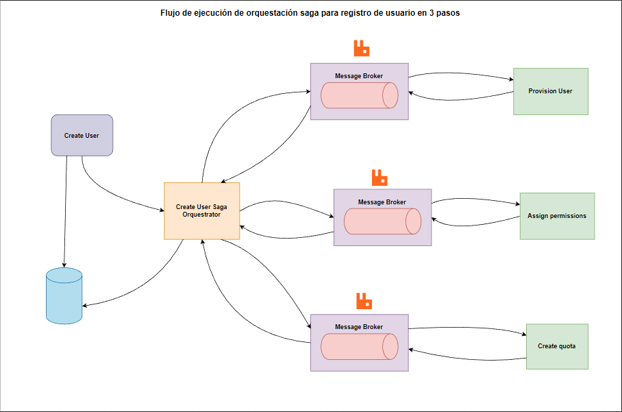

# Orquestador SAGA

Implementación de un orquestador SAGA para gestionar transacciones distribuidas con compensaciones automáticas.

## Integrantes

- Gabriel Castillejo Mendez
- Albert Argumedo Rosales

**Grabaciones**: <https://drive.google.com/drive/folders/1imHwL4w2BQUe6AHzS59ad04g1pGInjtx?usp=sharing>

## Qué hace

Este proyecto implementa el patrón SAGA para coordinar operaciones distribuidas:

- Provisiona usuarios
- Asigna permisos
- Crea cuotas de almacenamiento

Si algo falla, hace rollback automático de todo lo que ya se ejecutó.

## Tecnologías

- Python 3
- RabbitMQ (mensajería)
- SQLite (base de datos)
- Docker (infraestructura)
- Terraform (despliegue)

## Arquitectura



## Instalación

### Requisitos

- Python 3.8+
- Docker
- Terraform

### Setup

```bash
# Clonar el repo
git clone <repo-url>
cd PC3

# Crear virtualenv e instalar dependencias
python3 -m venv venv
source venv/bin/activate  # En Windows: venv\Scripts\activate
pip install -r requirements.txt

# Levantar infraestructura (RabbitMQ con Docker)
make apply
```

## Cómo usar

### 1. Iniciar el message broker

En una terminal:

```bash
cd src
python3 -m saga.message_broker
```

Deberías ver:

```
Escuchando mensajes en cola 'saga_commands'...
```

### 2. Ejecutar el orquestador

En otra terminal:

```bash
make run
```

Esto:

- Inicializa las bases de datos
- Ejecuta el demo con 2 SAGAs (1 exitoso, 1 con fallo)
- Muestra las métricas

## Estructura del proyecto

```
PC3/
├── src/saga/
│   ├── orchestrator.py      # Orquestador principal
│   ├── steps.py              # Pasos del SAGA (provision, permisos, cuotas)
│   ├── message_broker.py     # Worker que procesa comandos
│   ├── metrics.py            # Sistema de métricas y trends
│   ├── factory.py            # Factory de pasos
│   └── db/                   # Bases de datos SQLite
├── tests/
│   ├── unit/                 # Tests unitarios con métricas
│   └── e2e/                  # Tests E2E con caos controlado
├── infra/terraform/          # Configuración de Docker/RabbitMQ
└── docs/                     # Documentación por sprint
```

## Tests

### Ejecutar todos los tests

```bash
pytest tests/ -v
```

### Tests con cobertura

```bash
pytest tests/ --cov=src/saga --cov-report=term-missing
```

La cobertura mínima requerida es 85%.

### Tests E2E con caos

```bash
pytest tests/e2e/test_e2e_chaos.py -v -s
```

Esto ejecuta tests con fallos controlados y muestra:

- Tasa de recuperación
- MTTR (Mean Time To Recovery)
- Trends comparados con ejecuciones anteriores

## Sprints

El proyecto se desarrolló en 3 sprints:

- **Sprint 1** (D1-D3): Orquestador básico con compensaciones
- **Sprint 2** (D4-D6): Métricas, DLQ, backoff exponencial
- **Sprint 3** (D7-D10): Tests E2E con caos, informe de resiliencia con trends

Ver documentación detallada en `docs/Sprint1.md`, `docs/Sprint2.md`, `docs/Sprint3.md`.

## Características principales

### Compensaciones automáticas

Si un paso falla, el orquestador ejecuta las compensaciones en orden inverso:

```
✓ ProvisionUser
✓ AssignPermissions
✗ CreateQuota (falla)
↓
Compensating AssignPermissions...
Compensating ProvisionUser...
```

### Reintentos con backoff exponencial

Cada paso se reintenta hasta 5 veces con espera creciente:

- Retry 1: 1s
- Retry 2: 2s
- Retry 3: 4s
- Retry 4: 8s
- Retry 5: 16s

### Dead Letter Queue (DLQ)

Mensajes que fallan después de 5 reintentos se envían al DLQ para revisión manual.

### Métricas y trends

El sistema registra automáticamente:

- Tasa de éxito
- Tiempo de ejecución
- Reintentos promedio
- Mensajes en DLQ
- Pasos que más fallan

Compara con la ejecución anterior y muestra si mejoró o empeoró:

```
📊 Trends:
   📈 success_rate: mejora
   📉 retries: empeora
```

## Comandos útiles

```bash
# Ver ayuda del Makefile
make help

# Planear infraestructura
make plan

# Aplicar infraestructura
make apply

# Ejecutar orquestador
make run

# Ejecutar tests
make test

# Limpiar todo
make clean
```

## RabbitMQ UI

Accede a la interfaz web de RabbitMQ en: <http://localhost:15672>

- Usuario: `guest`
- Password: `guest`

Ahí puedes ver:

- Colas: `saga_commands`, `saga_dlq`
- Exchange: `saga_exchange`
- Mensajes en tránsito
